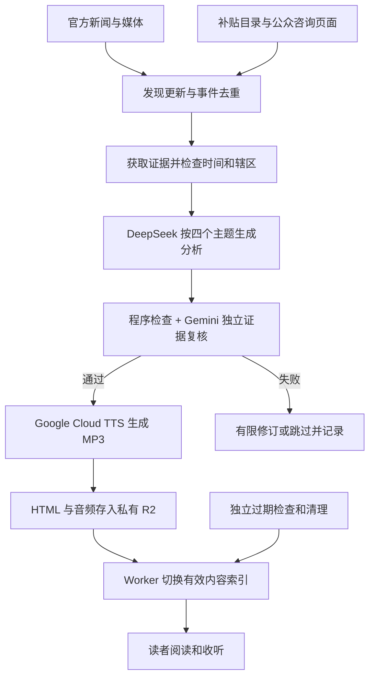

# 任务一：准备清单、全自动化方案、月成本

更新：2026-09-14。单位：美元。定位与内容规则见融合规格。目标为所选方案的必需准备项全部验证后，再执行固定日期 Test run。

## 一、按你现有账号安排准备顺序

你已确认有 GitHub、Cloudflare、Google AI Studio 和 DeepSeek；其他未准备。我们不需要重新注册这四个平台，也不需要立即增加 Azure。以下“账号已有”仅来自你的确认，不代表已登录或已测试调用。

| 顺序 | 准备项 | 默认推荐与费用 | 怎么准备 | 通过证据 |
|---|---|---|---|---|
| 1 | GitHub 项目 | 已有账号，私有仓库，Free | 创建本项目仓库；代码／配置进 Git，新闻与密钥排除 | 项目地址确定，测试工作流可手动运行 |
| 2 | DeepSeek API | 已有账号，低价按量 | 在官方控制台创建专用 Key，确认余额、模型和计费方式；少量充值即可，按实际最低金额 | 小样本调用能返回 JSON 与 usage |
| 3 | Gemini API | 已有 AI Studio，推荐预算按付费复核 | 创建项目 Key，选择可用 Flash-Lite，查看项目实际额度；付费启用后不能再把免费层重复抵扣 | 复核请求成功，模型、额度与费用记录完整 |
| 4 | Google Cloud TTS | 复用 Google 账号；Chirp 3 HD 免费额度内 $0 | 建立或选择 Cloud 项目，绑定计费，启用 Text-to-Speech；配置专用服务账号身份和调用权限 | 短中文 MP3 可播放，计数字段及费用可查 |
| 5 | Cloudflare 运行资源 | 已有账号；Worker、R2、D1 免费档起步 | 建 Worker，R2 设私有，准备 D1；配置最小权限部署／存储凭证 | 测试文件读写删除成功，Worker 与数据资源连通 |
| 6 | 域名与 HTTPS | 尚无；普通 .com 预算 $12—18/年 | 定名称后核查注册和续费价格再购买，接入 DNS；正式邮件需自有域名 | HTTPS 可用，域名归你管理 |
| 7 | Brevo | 尚无；Free 300 封/日 | 注册并通过发信审核，配置发件域名所要求的 DNS、DKIM 和 DMARC；准备 Key | 自有邮箱试收成功、域名认证通过 |
| 8 | 联系方式与合规文本 | 运营邮箱、有效邮寄地址 | 提供真实运营信息，准备隐私政策、召回同意、活动追踪同意和退订规则 | 不预勾选；同意记录可留存；退订不需登录 |
| 9 | 独立监测 | Healthchecks.io Free；账号状态待确认 | 建日更完成与清理完成检查；配置失败通知 | 模拟失败和未报到都通知到你 |
| 10 | 来源清单 | 无接口费的官方来源优先 | 分别验证入口、RSS／正文／日期提取、使用条件；维护 source-registry.json | 每类有可运行来源，本地政策与国际来源通过 |
| 11 | 本地环境 | 已找到 Python 3.12.14、Node、Git | 后续为本项目创建隔离依赖环境，不修改共享运行时 | 依赖安装及小样本程序检查通过 |
| 12 | 费用及运行限制 | 月度建议 $10 上限 | 记录各 API 实际 usage；设置应用侧停止规则和供应商账单提醒 | 到预算阈值停止新生成并通知 |

开户和资源启用操作需在你拥有的账号下完成。真实 Key 放 GitHub Secrets 或本机被忽略的 secrets 目录；不要放在聊天、文档或网页。Google TTS 自动任务优先使用 GitHub OIDC 对接 Workload Identity Federation；若初期使用服务账号 JSON，则仅存私密凭证位置并限制权限，不能提交仓库。

官方入口：[GitHub](https://github.com/)、[Cloudflare](https://dash.cloudflare.com/)、[DeepSeek](https://platform.deepseek.com/)、[AI Studio](https://aistudio.google.com/)、[Google Cloud](https://console.cloud.google.com/)、[TTS 开始使用](https://docs.cloud.google.com/text-to-speech/docs/get-started)、[Brevo](https://www.brevo.com/)、[Healthchecks](https://healthchecks.io/)。

Azure、付费新闻全文订阅、Vercel、独立 VPS 均不是所选方案的必需项。Tavily 为可选补搜；一旦选用，则验证其 Key、额度和原文提取能力后再计入准备完成。

## 二、来源准备包含新闻和本地机会两条线

新闻线：官方 RSS、新闻公告、可靠媒体，覆盖金融、科技、民生和移民，也必须覆盖美国与国际。

本地机会线：政府补贴目录、居民福利、征询页面、政策草案、会议／听证安排和官方参与入口。这些信息可能没有 RSS，不能仅接新闻媒体就宣称完整覆盖。

本次登记 19 个候选入口。入口可读与自动采集成功分别记状态。尤其：

- Vancouver 新闻页面已由网页工具读取，但本地 urllib 请求返回 403；需要正式 feed 或允许的替代获取方式。不能靠持续重试或绕过限制解决。
- Shape Your City 已确认是温哥华官方链接的参与平台，但网页提取目前只有外壳；项目列表和截止信息自动获取仍待实现和验证。
- BC 新闻入口可读，本机 Python HTTPS 请求存在证书链验证问题；修复受信任证书配置或验证目标云端环境，不能关闭证书验证。
- 所有来源均未启用生产采集，也未验证 2026-09-13 的完整覆盖。本次没有选择或分析该日新闻。

`source-registry.json` 是准备登记表，不是已运行 feed 配置；具体 feed_url 未验证时保留空值，不编造地址。启用条件包括稳定获取、时间解析、正文证据足够及使用方式明确。

## 三、每天如何全自动运行

### 调度

- 每 6 小时收集发现信息；只在材料变化时取正文，控制来源负担。
- 每天温哥华时间 05:17 生成上一自然日的主题分析，目标约 06:00 可读，不承诺分钟级准时。
- 06:47 检查并补跑缺失步骤；每次外部调用有限退避重试，总预算约束优先。
- 每天 00:01 进行过期文件清理，另设补查；该任务独立于生成结果。
- 使用 America/Vancouver 与更新的时区数据库，不套用 America/Los_Angeles。本地已验证 2026-11-15 偏移为 UTC−7；云端运行时也必须检查。[BC 时区公告](https://news.gov.bc.ca/releases/2026AG0013-000209)
- GitHub schedule 可能延迟或漏跑，监测以实际内容完成标志为准。[官方规则](https://docs.github.com/en/actions/reference/workflows-and-actions/events-that-trigger-workflows#schedule)

### 步骤与出错行为

| 步骤 | 输入与输出 | 关键规则／失败处理 |
|---|---|---|
| 发现 | RSS／列表页 → 候选记录 | 原始日期、更新日期、首次发现日期分开；首次看见旧项目不算新发布 |
| 去重 | 候选 → 事件集合 | URL、正文变化和同一事件聚类；转载同一报道不算独立证据 |
| 取证 | 入选事件 → 证据材料 | 不只截前 2,000 字而丢掉资格和例外；应保留与主张相关的完整段落 |
| 分析 | 编号证据 → 主题 JSON | 加拿大主视角；温哥华专项有依据才写；国际同等深度；只输出来源编号 |
| 检查 | JSON → 通过／需修订 | 程序核对结构编号，另一模型对照事实、否定词、数值、币种、辖区、时间与政策阶段 |
| 配音 | 最终正文 → MP3 | 朗读稿不另造事实；金额中的 $ 不能自动当美元；保留条件、否定词和不确定性 |
| 发布 | 合格正文＋音频 → 内容索引 | 先上传完整版本，再切索引；失败不覆盖可用旧版 |
| 收尾 | 结果 → 监测与费用 | 记录缺失主题与跳过原因；正常不发日报式运维邮件 |

复杂判断复核最多两轮；两家模型都不可用或没有足够证据时不发布新分析。第二模型也会出错，引用编号检查和模型复核都不是事实正确的保证。

TTS 默认普通话 Chirp 3 HD，可先使用 cmn-CN-Chirp3-HD-Achernar。程序按字节及句子分段，核对拼接后是否完整，再编码为 48 kbps 单声道 MP3；最终正文未变则复用。声音须在正式项目中验证。[声音清单](https://docs.cloud.google.com/text-to-speech/docs/list-voices-and-types)、[请求限制](https://docs.cloud.google.com/text-to-speech/quotas)

音频失败时可展示已核验正文并明确音频暂缺，补跑后恢复播放器；这种状态不是正常完整发布通过。用户点击或播放不重新触发 AI 与 TTS。

### 并发、费用与安全

生成任务按一期加锁；文章按日期＋主题＋版本识别，重试复用已完成状态。不要将自动生成内容 push 到 Git 来触发第二轮部署；代码部署与日更内容发布分开。

生成状态、证据与正文同样执行短期保留。抓取材料视为不可信输入，其中的提示或代码不执行。前端不包含 Key；发布接口只接受受限身份；订阅、活跃与纠错接口需要限流和防垃圾。

## 四、五天保留对架构的要求

按发布自然日计：9 月 14 日发布的一期可在 14—18 日读取，19 日 00:00 起新请求返回 410。不能因停更延长。

正文、JSON 和 MP3 放私有 R2，只经 Worker 提供；到期检查在返回缓存之前，缓存期限不能跨过截止时间。定时任务删除实际对象、失效索引、证据片段和临时产物。生命周期规则作为兜底，不能替代访问检查，因为其删除可能延迟。[R2 生命周期](https://developers.cloudflare.com/r2/buckets/object-lifecycles/)

Git 与旧部署包不保存新闻副本；不把全文写入长期日志或 D1 备份。必要的内容哈希、运行费用与状态可单独保留；政策页面差异检测仅保留最小哈希与时间等状态，不保留旧正文。新闻删除不影响订阅同意、退订入口和另有期限的汇总统计。第三方截图与已下载副本无法回收。

五天保留主要是产品选择；当前体量省下的实际存储费接近零。旧 URL 的 410 会影响长期搜索积累，首页可保留稳定说明，但不默认给旧文章留摘要。[Google HTTP 状态说明](https://developers.google.com/crawling/docs/troubleshooting/http-status-codes)

## 五、费用：推荐按 5—10 美元／月准备

预算假设：最多 150 篇／月；约 20 万配音字符，额外修订不超日总长度预算；主模型 600 万输入＋80 万输出 tokens，复核 150 万输入＋15 万输出；约 1 万页面访问、3,000 次音频播放、100 位订阅者。这里只是估算，实际账号 usage 决定账单。

| 项目 | 月估算 | 计算或条件 |
|---|---:|---|
| 新闻发现／取证 | $0 | 官方来源及允许使用的免费方式；可选补搜控制在免费额度 |
| DeepSeek Flash | $2.76 | 6×$0.30＋0.8×$1.20，按高峰且无缓存计 |
| Gemini 3.5 Flash-Lite | $0.825 | 1.5×$0.30＋0.15×$2.50，按标准付费计 |
| Google Cloud Chirp 3 HD TTS | $0 | 本项目 20 万字符低于每月 100 万字符免费额度；须启用计费 |
| Worker＋R2＋D1 | $0 | 小规模用量在免费额度内，不含超额或其他项目共享占用 |
| GitHub Actions | $0 | 预计 600—1,000 标准 Linux 分钟，账户余量须足够 |
| Brevo 召回 | $0 | 100 位订阅者的小规模发送，不超过每日额度 |
| Healthchecks | $0 | 免费档，只配置所需检查 |
| 域名摊销 | $1.25 | 用 $15／年举例，实际注册与续费另查 |
| 重试及修订余量 | $1.50 | 预算预留，不是固定收费 |
| 合计 | **$6.335，约 $6.34** | **建议预算 $5—10／月** |

主模型和复核的 tokens 预算包含筛选与取证分析的估计；重试由余量覆盖。4 篇基础日报的实际费用可能更低。免费 Gemini 实验档可能将月费降至 $1—3 左右，但不能保证产能和质量门槛都不受限；推荐档不依赖免费模型额度，也不把同一请求重复抵扣。

来源：[DeepSeek](https://api-docs.deepseek.com/quick_start/pricing/)、[Gemini](https://ai.google.dev/gemini-api/docs/pricing)、[Google TTS](https://cloud.google.com/text-to-speech/pricing)、[GitHub Actions](https://docs.github.com/en/billing/concepts/product-billing/github-actions)、[R2](https://developers.cloudflare.com/r2/pricing/)、[Worker](https://developers.cloudflare.com/workers/platform/pricing/)、[D1](https://developers.cloudflare.com/d1/platform/pricing/)、[Brevo](https://help.brevo.com/hc/en-us/articles/208589409-About-Brevo-s-pricing-plans)、[Healthchecks](https://healthchecks.io/pricing/)。价格于本次对话 2026-09-14 查核。

每天 25 分钟、48 kbps 音频约 9 MB，五天约 45 MB。R2 免费存储远大于此，但读取操作、Worker 请求与邮件量仍会计量。

升级条件：Worker Paid 当前 $5／月起；Brevo Starter 当前 $9／月起且随联系人和发送量分档。两者同时升级时总预算约 $20—25／月，不能继续宣传永远 $1—2。税费、开发人工、付费邮寄地址、新闻全文授权和编程工具订阅未计入。

预算控制：项目侧每月估算新生成支出达 $8 提醒、达 $10 停止新付费生成及非必要重试；保留有效旧文，通知你检查。域名和供应商固定套餐独立记录。云预算提醒不一定自动阻止扣费，不能把提醒当硬上限。

## 六、逐环节免费／低价／稳妥方案

| 环节 | 免费 | 低价 | 稳妥 |
|---|---|---|---|
| 新闻 | 官方 RSS／公告，按允许方式使用 | Tavily 每月 1,000 credits 免费额度，额外按量 | 固定来源＋原文复核，确有需求再谈全文授权 |
| AI | Gemini 有免费额度的模型；达限暂停 | DeepSeek Flash；低峰或缓存降低费用但不依赖优惠 | DeepSeek 写＋Gemini 独立复核，预算按付费 |
| TTS | 浏览器朗读可演示；Azure F0 50 万字符但需新账号 | Google WaveNet 400 万字符月免费额度、超出 $4／百万 | **默认 Google Chirp 3 HD：100 万字符月免费，超出 $30／百万** |
| 托管 | Worker Static Assets／Pages 的静态资源 | 本项目 Worker Free＋私有 R2 | 超额或资源限制确有需要时 Worker Paid，保留监测 |
| 用户数据 | D1 免费额度 | 仍用 D1，按用途保存最少字段 | 增加退订同步、限流、审计与恢复能力 |
| 邮件 | Brevo Free 300 封／日 | Starter $9／月起 | 按联系人与发送量升级，处理退信／投诉／退订 |
| 自动任务 | GitHub Free 的标准运行额度 | 超额按量 | 独立漏跑监测＋补跑，不靠无限重试 |
| 域名 | workers.dev 用于开发预览 | 普通 .com；正式邮件使用自有域名 | 自动续费、双重验证与到期提醒 |

Tavily basic 搜索每次 1 credit，advanced 每次 2 credits，正文提取另计，按量约 $0.008／credit；不要默认开启昂贵的深度研究。[官方计费](https://docs.tavily.com/documentation/api-credits)

Google Cloud TTS 与 Gemini TTS 是不同产品，不能混用字符免费额度和音频 token 价格。Azure 不作为当前必需账号，Google 方案不可用时才考虑。[Google TTS 计费](https://cloud.google.com/text-to-speech/pricing)、[Azure 计费](https://azure.microsoft.com/en-us/pricing/details/speech/)

NewsAPI 免费档仅开发测试，不适合正式上线。Vercel Hobby 限个人非商业用途；本项目未来本地广告业务不以它作为默认部署。[NewsAPI](https://newsapi.org/pricing)、[Vercel Hobby](https://vercel.com/docs/plans/hobby)

## 七、邮件与用户数据在任务一的准备边界

本轮准备账号、域名认证方案、凭证与合规字段，不发送真实召回，也不追踪现有用户。任务三建议轻量 A：已明确同意的订阅者，已知有效活跃超过 72 小时才候选，同轮最多两次，回访／退订后撤销待发。无活动追踪同意或没有可识别记录，不自动认定不活跃。B 为每三天全量发送，简单但会打扰活跃读者。

同意记录、发送者身份、联系及邮寄地址、退订、退信和投诉停止发送名单必须具备。退订目标立即生效；CASL 的相关机制至少有效 60 天，处理不迟于 10 个工作日，不随五天新闻过期。[CRTC](https://crtc.gc.ca/eng/com500/faq500.htm)

城市与兴趣自愿填写；活动数据用途、保留期和供应商需透明，不根据阅读移民新闻推断移民身份，不向广告主提供个人邮箱或阅读轨迹。[加拿大隐私法适用](https://www.priv.gc.ca/en/privacy-topics/privacy-laws-in-canada/02_05_d_15/)

## 八、任务二启动前的验证

账号存在、Key 生成、接口连通、来源可用和完整流程通过是不同状态。依次完成：

1. 所选必需账号与项目归属确认，供应商额度／预算记录。
2. 短小中性文本的模型／TTS 连通验证，测试文件的上传读取删除；不使用目标日期新闻。
3. 新闻和政策入口的自动获取、日期与辖区提取检查，包括至少一个本地公众咨询来源和国际来源。
4. 域名、监测以及所选邮件准备项验证，合规联系信息补齐。
5. 才执行固定 2026-09-13 新闻的完整手动 Test run；若执行时该日已过期，用隔离历史预览，不作为当天新闻上线。

测试必须交付 Title、正文、真实 Citations、MP3、预览页、费用与核验报告；来源虚构、核心事实错误、移民资格或政策状态错误直接不通过。正常内容与音频完整、加拿大视角清楚、本地特殊影响有依据、国际认真分析，方能进入后续自动运行验证。任务三至五的详细实现仍按原先顺序推进。
